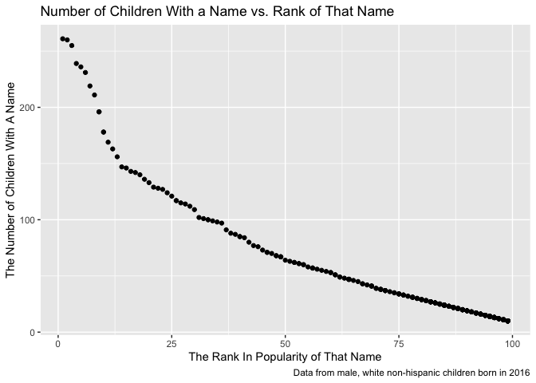

p8105\_hw2\_yc4018
================
Yuxuan Chen
10/8/2021

**Problem1**

``` r
library(readxl)
library(tidyverse)
library(lubridate)
```

1.  Read and clean the Mr. Trash Wheel sheet:

``` r
trashwheel_df = 
  read_excel("./data/Trash-Wheel-Collection-Totals-7-2020-2.xlsx", sheet = "Mr. Trash Wheel", range = "A2:N535") %>% #Read the excel file
  janitor::clean_names() %>% #clean variables' names
  transform(dumpster = as.numeric(dumpster)) %>% 
  drop_na(dumpster) %>% 
  mutate(sports_balls = round(sports_balls)) #round the number of sports balls to the nearest integer

knitr::kable(trashwheel_df[0:10,])
```

| dumpster | month | year | date       | weight\_tons | volume\_cubic\_yards | plastic\_bottles | polystyrene | cigarette\_butts | glass\_bottles | grocery\_bags | chip\_bags | sports\_balls | homes\_powered |
|---------:|:------|-----:|:-----------|-------------:|---------------------:|-----------------:|------------:|-----------------:|---------------:|--------------:|-----------:|--------------:|---------------:|
|        1 | May   | 2014 | 2014-05-16 |         4.31 |                   18 |             1450 |        1820 |           126000 |             72 |           584 |       1162 |             7 |              0 |
|        2 | May   | 2014 | 2014-05-16 |         2.74 |                   13 |             1120 |        1030 |            91000 |             42 |           496 |        874 |             5 |              0 |
|        3 | May   | 2014 | 2014-05-16 |         3.45 |                   15 |             2450 |        3100 |           105000 |             50 |          1080 |       2032 |             6 |              0 |
|        4 | May   | 2014 | 2014-05-17 |         3.10 |                   15 |             2380 |        2730 |           100000 |             52 |           896 |       1971 |             6 |              0 |
|        5 | May   | 2014 | 2014-05-17 |         4.06 |                   18 |              980 |         870 |           120000 |             72 |           368 |        753 |             7 |              0 |
|        6 | May   | 2014 | 2014-05-20 |         2.71 |                   13 |             1430 |        2140 |            90000 |             46 |           672 |       1144 |             5 |              0 |
|        7 | May   | 2014 | 2014-05-21 |         1.91 |                    8 |              910 |        1090 |            56000 |             32 |           416 |        692 |             3 |              0 |
|        8 | May   | 2014 | 2014-05-28 |         3.70 |                   16 |             3580 |        4310 |           112000 |             58 |          1552 |       3015 |             6 |              0 |
|        9 | June  | 2014 | 2014-06-05 |         2.52 |                   14 |             2400 |        2790 |            98000 |             49 |           984 |       1988 |             6 |              0 |
|       10 | June  | 2014 | 2014-06-11 |         3.76 |                   18 |             1340 |        1730 |           130000 |             75 |           448 |       1066 |             7 |              0 |

2.  Read and clean precipitation data for 2018 and 2019

``` r
precipitation2018_df = 
  read_excel("./data/Trash-Wheel-Collection-Totals-7-2020-2.xlsx", sheet = "2018 Precipitation", range = "A2:B15") %>% 
  janitor::clean_names() %>% #clean variables' names
  drop_na(month) %>%  #omit rows without precipitation data
  mutate(year = "2018") #add an variable for year
knitr::kable(precipitation2018_df)
```

| month | total | year |
|------:|------:|:-----|
|     1 |  0.94 | 2018 |
|     2 |  4.80 | 2018 |
|     3 |  2.69 | 2018 |
|     4 |  4.69 | 2018 |
|     5 |  9.27 | 2018 |
|     6 |  4.77 | 2018 |
|     7 | 10.20 | 2018 |
|     8 |  6.45 | 2018 |
|     9 | 10.47 | 2018 |
|    10 |  2.12 | 2018 |
|    11 |  7.82 | 2018 |
|    12 |  6.11 | 2018 |

``` r
precipitation2019_df = 
  read_excel("./data/Trash-Wheel-Collection-Totals-7-2020-2.xlsx", sheet = "2019 Precipitation", range = "A2:B15") %>% 
  janitor::clean_names() %>% #clean variables' names
  drop_na(month) %>%  #omit rows without precipitation data
  mutate(year = "2019") #add an variable for year
knitr::kable(precipitation2019_df)
```

| month | total | year |
|------:|------:|:-----|
|     1 |  3.10 | 2019 |
|     2 |  3.64 | 2019 |
|     3 |  4.47 | 2019 |
|     4 |  1.46 | 2019 |
|     5 |  3.58 | 2019 |
|     6 |  0.42 | 2019 |
|     7 |  3.85 | 2019 |
|     8 |  2.39 | 2019 |
|     9 |  0.16 | 2019 |
|    10 |  5.45 | 2019 |
|    11 |  1.86 | 2019 |
|    12 |  3.57 | 2019 |

``` r
#combine precipitation data for 2018 and 2019
precipitation_df = 
  bind_rows(precipitation2018_df, precipitation2019_df) %>% 
  mutate(month = month.name[month])
knitr::kable(precipitation_df)
```

| month     | total | year |
|:----------|------:|:-----|
| January   |  0.94 | 2018 |
| February  |  4.80 | 2018 |
| March     |  2.69 | 2018 |
| April     |  4.69 | 2018 |
| May       |  9.27 | 2018 |
| June      |  4.77 | 2018 |
| July      | 10.20 | 2018 |
| August    |  6.45 | 2018 |
| September | 10.47 | 2018 |
| October   |  2.12 | 2018 |
| November  |  7.82 | 2018 |
| December  |  6.11 | 2018 |
| January   |  3.10 | 2019 |
| February  |  3.64 | 2019 |
| March     |  4.47 | 2019 |
| April     |  1.46 | 2019 |
| May       |  3.58 | 2019 |
| June      |  0.42 | 2019 |
| July      |  3.85 | 2019 |
| August    |  2.39 | 2019 |
| September |  0.16 | 2019 |
| October   |  5.45 | 2019 |
| November  |  1.86 | 2019 |
| December  |  3.57 | 2019 |

3.  Datasets Interpretation

``` r
#Total precipitation in 2018
sum(pull(precipitation2018_df,total))
## [1] 70.33
#median number of sports balls in a dumpster in 2019
sports_balls2019 = filter(trashwheel_df, year == 2019)
median(pull(sports_balls2019, sports_balls))
## [1] 9
```

-   After read and clean the Mr. Trash Wheel sheet, I have a resulting
    dataset named trashwheel\_df. The trashwheel\_df dataset contains
    453 observations of 14 variables. The dimension of this dataset is
    (453, 14). The range of the year is (2014, 2021). I think dumpster,
    date, weight\_tons, volume\_cubic\_yards are key variables, since
    they gives the information on dumpter number, date of collection,
    amount weight of total litter, and amount volume of total litter.  
-   After read, clean, and combine precipitation data for 2018 and 2019,
    I have a resulting dataset named precipitation\_df. The
    precipitation\_df contains 24 observations of 3 variables. The
    dimension of this dataset is (24, 3). The range of the year is
    (2018, 2019). I think key variable is the total variable, since it
    shows the precipitation amounts on the associated month and year.
-   Based on the above calculations, the total precipitation in 2018 is
    70.33; and the median number of sports balls in a dumpster in 2019
    is 9.

**Problem2**  
1) read and clean pols-month.csv:

``` r
polsmonth_df = 
  read_csv("./data/pols-month.csv") %>% 
  janitor::clean_names() %>% #clean the names
  separate(mon, into = c("year", "month", "day"), convert = TRUE) %>% 
      #break up one variable into three integer variables; convert=TRUE: detects column classes
  mutate(month = month.name[month]) %>% #replace month number with month name
  mutate(president = recode(prez_dem, '1' = "dem", '0' = "gop")) %>% #create president variable taking values gop and dem
  select(-c("prez_dem", "prez_gop","day")) #remove prez_dem, prez_gop, day variable
knitr::kable(polsmonth_df[0:10,])
```

| year | month     | gov\_gop | sen\_gop | rep\_gop | gov\_dem | sen\_dem | rep\_dem | president |
|-----:|:----------|---------:|---------:|---------:|---------:|---------:|---------:|:----------|
| 1947 | January   |       23 |       51 |      253 |       23 |       45 |      198 | dem       |
| 1947 | February  |       23 |       51 |      253 |       23 |       45 |      198 | dem       |
| 1947 | March     |       23 |       51 |      253 |       23 |       45 |      198 | dem       |
| 1947 | April     |       23 |       51 |      253 |       23 |       45 |      198 | dem       |
| 1947 | May       |       23 |       51 |      253 |       23 |       45 |      198 | dem       |
| 1947 | June      |       23 |       51 |      253 |       23 |       45 |      198 | dem       |
| 1947 | July      |       23 |       51 |      253 |       23 |       45 |      198 | dem       |
| 1947 | August    |       23 |       51 |      253 |       23 |       45 |      198 | dem       |
| 1947 | September |       23 |       51 |      253 |       23 |       45 |      198 | dem       |
| 1947 | October   |       23 |       51 |      253 |       23 |       45 |      198 | dem       |

-   I found there are five values of “2” for observations in
    “prez\_gop”, which are assumed to be typographical error and the “2”
    means “1”. Hence, whenever there are “0” value in prez\_dem imply
    the president was not democratic, but republican.

2.  read and clean snp.csv

``` r
snp_df = 
  read_csv("./data/snp.csv") %>% 
  janitor::clean_names() %>%  #clean the names
  mutate(date = parse_date_time2(date, "mdy", cutoff_2000 = 49)) %>% #change date-time format
  separate(date, into = c('year', 'month', 'day'), convert = TRUE) %>% 
  arrange(year, month) %>% 
  mutate(month = month.name[month]) %>% 
  select(-day) %>% 
  relocate(year, month) #let year and month be leading columns

knitr::kable(snp_df[0:10,]) 
```

| year | month     | close |
|-----:|:----------|------:|
| 1950 | January   | 17.05 |
| 1950 | February  | 17.22 |
| 1950 | March     | 17.29 |
| 1950 | April     | 17.96 |
| 1950 | May       | 18.78 |
| 1950 | June      | 17.69 |
| 1950 | July      | 17.84 |
| 1950 | August    | 18.42 |
| 1950 | September | 19.45 |
| 1950 | October   | 19.53 |

3.  read, clean, and tidy unemployment.csv:

``` r
unemployment_df = 
  read_csv("./data/unemployment.csv") %>% 
  janitor::clean_names() %>% 
  pivot_longer(
    jan:dec, #specify the range of variables
    names_to = "month", #name the new variable as "month"
    values_to = "unemployment_rate") %>%  #put all values into a new variable named "unemployment_rate"
  drop_na(unemployment_rate) %>% 
  mutate(month = match(str_to_title(month), month.abb)) %>% #capitalize first letter of values in month, and match them to the month abbreviation
  mutate(month = month.name[month])
knitr::kable(unemployment_df[0:10,]) 
```

| year | month     | unemployment\_rate |
|-----:|:----------|-------------------:|
| 1948 | January   |                3.4 |
| 1948 | February  |                3.8 |
| 1948 | March     |                4.0 |
| 1948 | April     |                3.9 |
| 1948 | May       |                3.5 |
| 1948 | June      |                3.6 |
| 1948 | July      |                3.6 |
| 1948 | August    |                3.9 |
| 1948 | September |                3.8 |
| 1948 | October   |                3.7 |

4.  merging snp into pols, then merging unemployment into the result：

``` r
pols_snp_df = 
  left_join(polsmonth_df, snp_df, by = c("year", "month")) #merge by "year", and "month"

pols_snp_unemp_df =
  left_join(pols_snp_df, unemployment_df, by = c("year", "month"))
knitr::kable(pols_snp_unemp_df[0:10,]) 
```

| year | month     | gov\_gop | sen\_gop | rep\_gop | gov\_dem | sen\_dem | rep\_dem | president | close | unemployment\_rate |
|-----:|:----------|---------:|---------:|---------:|---------:|---------:|---------:|:----------|------:|-------------------:|
| 1947 | January   |       23 |       51 |      253 |       23 |       45 |      198 | dem       |    NA |                 NA |
| 1947 | February  |       23 |       51 |      253 |       23 |       45 |      198 | dem       |    NA |                 NA |
| 1947 | March     |       23 |       51 |      253 |       23 |       45 |      198 | dem       |    NA |                 NA |
| 1947 | April     |       23 |       51 |      253 |       23 |       45 |      198 | dem       |    NA |                 NA |
| 1947 | May       |       23 |       51 |      253 |       23 |       45 |      198 | dem       |    NA |                 NA |
| 1947 | June      |       23 |       51 |      253 |       23 |       45 |      198 | dem       |    NA |                 NA |
| 1947 | July      |       23 |       51 |      253 |       23 |       45 |      198 | dem       |    NA |                 NA |
| 1947 | August    |       23 |       51 |      253 |       23 |       45 |      198 | dem       |    NA |                 NA |
| 1947 | September |       23 |       51 |      253 |       23 |       45 |      198 | dem       |    NA |                 NA |
| 1947 | October   |       23 |       51 |      253 |       23 |       45 |      198 | dem       |    NA |                 NA |

5.  Dataset Interpretation:  

-   The polsmonth\_df dataset contains 822 observations of 9 variables
    related to the number of national politicians who are democratic or
    republican from January, 1947 to June, 2015, and indicates whether
    the president was Democratic or Republican on the associated date.
    The dimension of this dataset is (822, 9). The range of the year is
    (1947, 2015). The key variables are the president’s party and the
    number of Republican and Democratic governors, senators, and
    representatives on the associated month and year.  
-   The snp\_df dataset contains 787 observations of 3 variables related
    to Standard & Poor’s stock market index (S&P). The dimension of this
    dataset is (787, 3). The range of the year is (1950, 2015). The key
    variables are the closing values of the S&P stock index on the
    associated month and year. The names of key variables are: year,
    month, and the closing values of the S&P stock index.
-   The unemployment\_df dataset contains 810 observations of 3
    variables. The dimension of this dataset is (810, 3). The range of
    the year is (1948, 2015). The key variables are the percentage of
    unemployment in every month of the associated year. The names of key
    variables are: year, month, and unemployment\_rate.
-   The pols\_snp\_unemp\_df is the merged dataset after combining
    polsmonth\_df, snp\_df, and unemployment\_df The dimension of this
    dataset is (822, 11). The range of the year is (1947, 2015). These
    dataset has the same dimension as the polsmonth\_df dataset, since I
    used `left_join()` function to merge snp\_df and unemployment\_df
    into polsmonth\_df. The key variables are the president’s party,
    closing values of the S&P stock index, and percentage of
    unemployment on the associated month and year. The names of key
    variables are: president, close, unemployment\_rate.

**Problem 3**  
1) read, clean, and tidy Popular\_Baby\_Names.csv

``` r
babynames_df = 
  read.csv("./data/Popular_Baby_Names.csv") %>% 
  janitor::clean_names() %>% 
  rename(childs_first_name = child_s_first_name) %>% 
  mutate(
    gender = str_to_title(gender),
    childs_first_name = str_to_title(childs_first_name),
    ethnicity = str_to_title(ethnicity)) #captilize the first letter in each word.
```

``` r
unique(pull(babynames_df, ethnicity))
```

    ## [1] "Asian And Pacific Islander" "Black Non Hispanic"        
    ## [3] "Hispanic"                   "White Non Hispanic"        
    ## [5] "Asian And Paci"             "Black Non Hisp"            
    ## [7] "White Non Hisp"

-   After the unique values in ethnicity variable are output, I found
    out that the “White Non Hispanic” and “White Non Hisp”, “Asian And
    Pacific Islander” and “Asian And Paci”, “Black Non Hispanic” and
    “Black Non Hisp” are represent the same meaning with different
    categorical names. Hence, for consistency across datasets, I renamed
    these values in ethnicity variable into 4 categories.

``` r
babynames_df = 
  babynames_df %>% 
  mutate(
    ethnicity = replace(ethnicity, ethnicity == "Asian And Paci", "Asian And Pacific Islander"),
    ethnicity = replace(ethnicity, ethnicity == "White Non Hisp", "White Non Hispanic"),
    ethnicity = replace(ethnicity, ethnicity == "Black Non Hisp", "Black Non Hispanic"),
    )
```

-   Remove duplicated rows

``` r
# Remove duplicated rows based on year_of_birth, gender, ethnicity, childs_first_name, count, and rank
babynames_df = 
  babynames_df %>% 
  distinct(year_of_birth, gender, ethnicity, childs_first_name, count, rank, .keep_all = TRUE)
knitr::kable(babynames_df[0:10,]) 
```

| year\_of\_birth | gender | ethnicity                  | childs\_first\_name | count | rank |
|----------------:|:-------|:---------------------------|:--------------------|------:|-----:|
|            2016 | Female | Asian And Pacific Islander | Olivia              |   172 |    1 |
|            2016 | Female | Asian And Pacific Islander | Chloe               |   112 |    2 |
|            2016 | Female | Asian And Pacific Islander | Sophia              |   104 |    3 |
|            2016 | Female | Asian And Pacific Islander | Emily               |    99 |    4 |
|            2016 | Female | Asian And Pacific Islander | Emma                |    99 |    4 |
|            2016 | Female | Asian And Pacific Islander | Mia                 |    79 |    5 |
|            2016 | Female | Asian And Pacific Islander | Charlotte           |    59 |    6 |
|            2016 | Female | Asian And Pacific Islander | Sarah               |    57 |    7 |
|            2016 | Female | Asian And Pacific Islander | Isabella            |    56 |    8 |
|            2016 | Female | Asian And Pacific Islander | Hannah              |    56 |    8 |

2.  well-structured, reader-friendly table —-pivor\_wider!

-   Table showing the rank in popularity of the name “Olivia” as a
    female baby name over time

``` r
olivia_df = 
  babynames_df %>% 
  filter(childs_first_name == "Olivia" & gender == "Female") %>% 
  select(-c("gender", "childs_first_name", "count")) %>% 
  pivot_wider(
    names_from = "year_of_birth",
    values_from = "rank"
  ) 
knitr::kable(olivia_df) 
```

| ethnicity                  | 2016 | 2015 | 2014 | 2013 | 2012 | 2011 |
|:---------------------------|-----:|-----:|-----:|-----:|-----:|-----:|
| Asian And Pacific Islander |    1 |    1 |    1 |    3 |    3 |    4 |
| Black Non Hispanic         |    8 |    4 |    8 |    6 |    8 |   10 |
| Hispanic                   |   13 |   16 |   16 |   22 |   22 |   18 |
| White Non Hispanic         |    1 |    1 |    1 |    1 |    4 |    2 |

-   Table showing the most popular name among male children over time.

``` r
malename_df = 
  babynames_df %>% 
  filter(gender == "Male" & rank == "1") %>% 
  select(-c("gender", "rank", "count")) %>% 
  pivot_wider(
    names_from = "year_of_birth",
    values_from = "childs_first_name"
  ) 
knitr::kable(malename_df) 
```

| ethnicity                  | 2016   | 2015   | 2014   | 2013   | 2012   | 2011    |
|:---------------------------|:-------|:-------|:-------|:-------|:-------|:--------|
| Asian And Pacific Islander | Ethan  | Jayden | Jayden | Jayden | Ryan   | Ethan   |
| Black Non Hispanic         | Noah   | Noah   | Ethan  | Ethan  | Jayden | Jayden  |
| Hispanic                   | Liam   | Liam   | Liam   | Jayden | Jayden | Jayden  |
| White Non Hispanic         | Joseph | David  | Joseph | David  | Joseph | Michael |

3.  Scatter plot of the number of children with a name vs. the rank in
    popularity of that name

``` r
white_non_hispanic_male_df = 
  babynames_df %>% 
  filter(gender == "Male" & ethnicity == "White Non Hispanic" & year_of_birth == "2016" )

white_non_hispanic_male_df %>% 
  ggplot(aes(x = rank, y = count)) + 
  geom_point() +
  labs(
    title = "Number of Children With a Name vs. Rank of That Name", 
    x = "The Rank In Popularity of That Name",
    y = "The Number of Children With A Name",
    caption = "Data from male, white non-hispanic children born in 2016"
  )
```

<!-- -->
